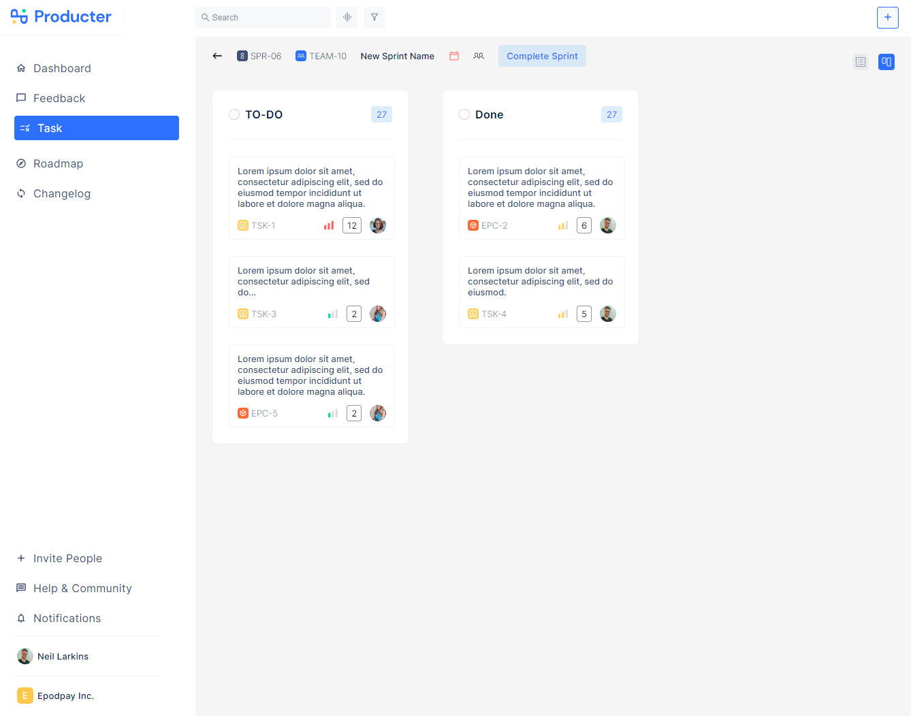

# Producter Task (Kanban)

By clicking the add (+) button in the Header section, you can add items to the "To Do" section by entering the modal and move these items between the "To Do" and "Done" sections.

Click demo to try it by yourself!

## Producter Kanban Link

You can view the site here
[Click Me](https://producter-task-kanban.vercel.app/task)

## Topics

- ReactJS
- Redux Toolkit
- React Hooks
- React Router
- React Beautiful DnD
- Kanban Board
- CSS
- MUI Icons
- Deployed with Vercel

## Author

Ozan Gürsucu (ozngrsc)

